# *CVDS - LABORATORIO 2 - PATTERNS*
Jose Ricardo Vasquez\
Maria Valentina Torres

## LA HERRAMIENTA MAVEN

### ¿Cuál es su mayor utilidad?

La meta principal de Maven es posibilitar que un desarrollador comprenda rápidamente el estado completo de un proyecto de desarrollo. Para alcanzar este propósito, Maven aborda diferentes aspectos:

1. Simplificar el proceso de construcción.
2. Ofrecer un sistema de construcción estandarizado.
3. Suministrar información de calidad sobre los proyectos.
4. Promover la adopción de prácticas de desarrollo óptimas.

### Fases de Maven

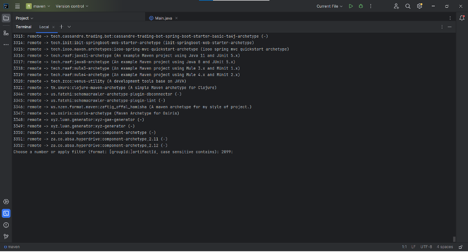

- Maven Validate: Se verifica que el proyecto contenga toda la información necesaria para su procesamiento.

- Maven Compile: Compila los archivos fuente .java y genera los archivos compilados en las carpetas de destino.

- Maven Test: Ejecuta las pruebas unitarias construidas para el código, asegurando su corrección.

- Maven Package: Empaqueta el código en un formato estándar de Java que permita su ejecución o despliegue en un servidor. Los formatos comunes de empaquetado son JAR, WAR y EAR.

- Maven Verify: Lanza pruebas de integración para confirmar el funcionamiento correcto y la calidad del proyecto.

- Maven LifeCycle (Install): Despliega el artefacto en el repositorio local con su versión, permitiendo que otros artefactos hagan uso de él.

- Maven Deploy: Despliega el artefacto en un servidor remoto para compartirlo entre desarrollos, facilitando su utilización por otros desarrolladores.

### Ciclo de vida de construcción

Correcto, Maven cuenta con tres tipos de ciclo de vida de construcción:

1. default: Gestiona la construcción, empaquetamiento y despliegue del proyecto. Este ciclo de vida incluye las fases de validate, compile, test, package, verify, install y deploy.

2. clean: Gestiona la limpieza del espacio de trabajo eliminando los archivos generados en la fase de construcción. Esto incluye la eliminación del directorio target y cualquier otro archivo o directorio generado durante el proceso de construcción.

3. site: Gestiona la creación del sitio web de Maven, que incluye la documentación generada automáticamente, informes de pruebas y otros recursos relacionados con el proyecto. Esta fase se utiliza para generar informes y documentación del proyecto.


### ¿Para què sirven los plugins?

Los complementos son componentes que ofrecen funciones específicas a Maven. Existen complementos que se encargan de manejar las dependencias, compilar código Java, ejecutar pruebas de JUnit, empaquetar el código en archivos JAR, entre otros.

Por ejemplo, el complemento Compiler cuenta con dos funciones principales: compile y testCompile.

### ¿Què es y para què sirve el repsitorio central de Maven?

El repositorio de Maven, también conocido como repositorio central, está estructurado de manera que permite almacenar archivos como los JAR en diferentes versiones. Esto facilita la identificación y descubrimiento de las versiones de los artefactos mediante un mecanismo de denominación bien conocido.

## **EJERCICIO DE LAS FIGURAS**

### **CREAR UN PROYECTO CON MAVEN**

Buscar cómo se crea un proyecto maven con ayuda de los arquetipos(archetypes).

```console
mvn exec:java -Dexec.mainClass="edu.eci.cvds.patterns.archetype.App"
```

Busque cómo ejecutar desde línea de comandos el objetivo "generate" del plugin "archetype",con los siguientes parámetros:

```yml
ProjectId: org.apache.maven.archetypes:maven-archetype-quickstart:1.0
Id del Grupo: edu.eci.cvds
Id del Artefacto: Patterns
Paquete: edu.eci.cvds.patterns.archetype
```


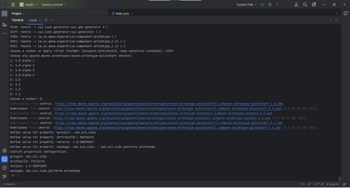

```console
  cd patterns
  tree
```
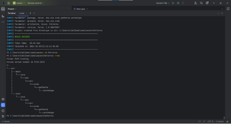

## AJUSTAR ALGUNAS CONFIGURACIONES EN EL PROYECTO

Para cambiar la versión entramos al archivo POM.xml y en la sección de dependencias modificamos la segunda y tercera linea.

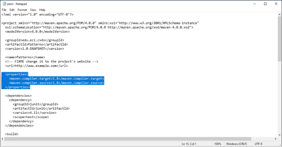

## COMPILAR Y EJECUTAR

Lo siguiente será compilar con el comando:

```mnv package```

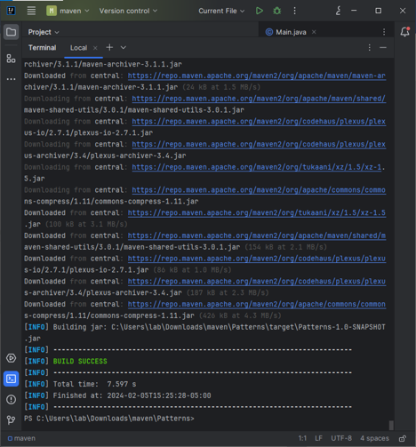

Busque cómo ejecutar desde línea de comandos, un proyecto maven y verifique la salida cuando se ejecuta con la clase App.java como parámetro en "mainClass". Tip: https://www.mojohaus.org/exec-maven-plugin/usage.html

```console
mvn exec:java -Dexec.mainClass="edu.eci.cvds.patterns.archetype.App"
```
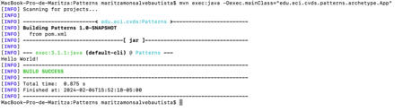

Realice el cambio en la clase App.java para crear un saludo personalizado, basado en los parámetros de entrada a la aplicación.

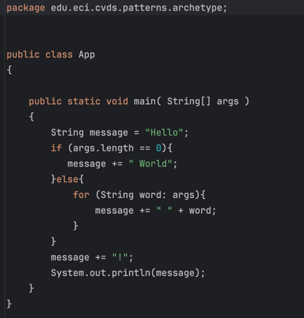

Buscar cómo enviar parámetros al plugin "exec".

```
mvn exec:java -Dexec.mainClass="edu.eci.cvds.patterns.arquetype.App" -Dexec.args="'argument1' 'argument2'"
```
Ejecutar nuevamente la clase desde línea de comandos y verificar la salida: Hello World!\
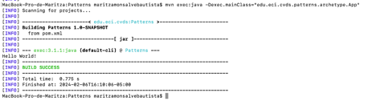
Ejecutar la clase desde línea de comandos enviando su nombre como parámetro y verificar la salida. Ej: Hello Pepito!\
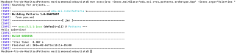
Ejecutar la clase con su nombre y apellido como parámetro. ¿Qué sucedió?\
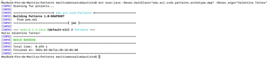
Verifique cómo enviar los parámetros de forma "compuesta" para que el saludo se realice con nombre y apellido.\
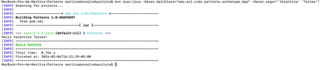

## HACER EL ESQUELETO DE LA APLICACIÓN

De acuerdo a las instrucciones del proyecto la estructura queda de la siguiente manera:
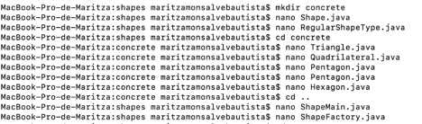
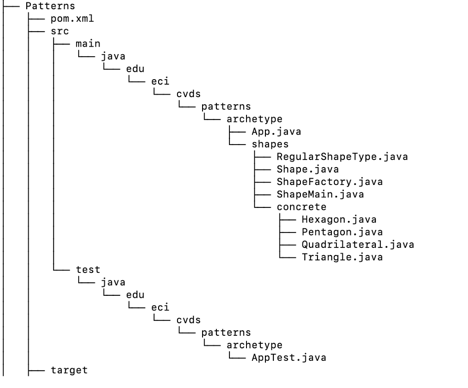

Analice y asegúrese de entender cada una de las instrucciones que se encuentran en todas las clases que se crearon anteriormente. Cree el archivo ShapeFactory.java en el directorio src/main/java/edu/eci/cvds/patterns/shapes implementando el patrón fábrica (Hint: https://refactoring.guru/design-patterns/catalog), haciendo uso de la instrucción switch-case de Java y usando las enumeraciones.

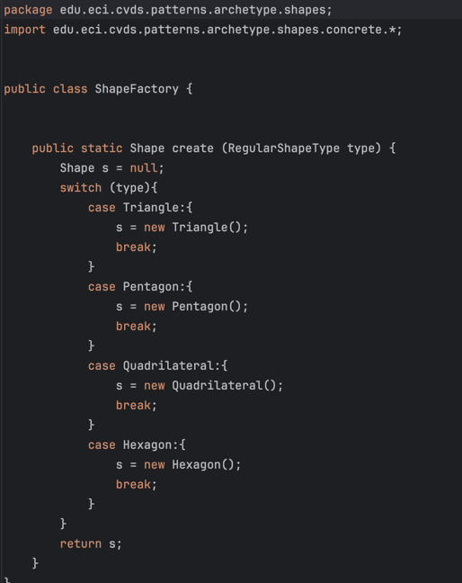

Ejecute múltiples veces la clase ShapeMain, usando el plugin exec de maven con los siguientes parámetros y verifique la salida en consola para cada una: - Sin parámetros - Parámetro: qwerty - Parámetro: pentagon - Parámetro: Hexagon

Sin parámetro:\
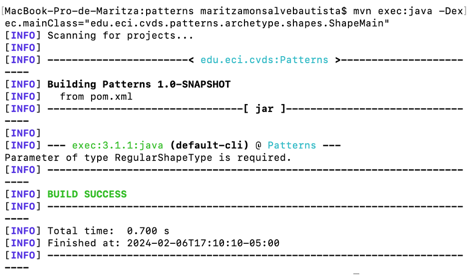
Parametro : qwerty\
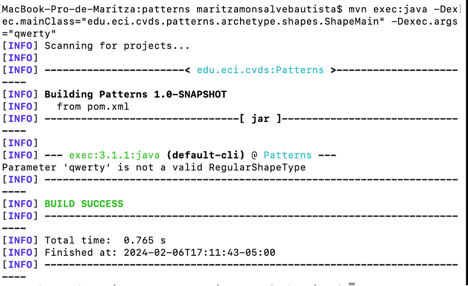
Párametro : Pentagon\
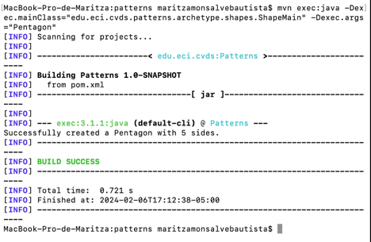
Párametro : Hexagon\
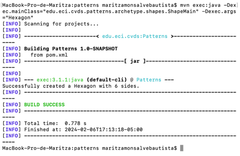

#### ¿Cuál(es) de las anteriores instrucciones se ejecutan y funcionan correctamente y por qué?

Todas las instrucciones ejecutadas operan adecuadamente, ya que realizan validaciones correspondientes, como la existencia de un parámetro y la presencia de la figura ingresada. Finalmente, si se cumplen estas condiciones, se muestran los vértices de la figura.

## BIBLIOGRAFÍA
Se uso contenido de:

- https://www.arquitecturajava.com/que-es-un-maven-lifecycle-y-como-funciona
- https://maven.apache.org/what-is-maven.html
- https://www.ibm.com/docs/es/ibm-mq/9.1?topic=applications-java-application-development-using-maven-repository
- https://refactoring.guru/design-patterns/factory-method
