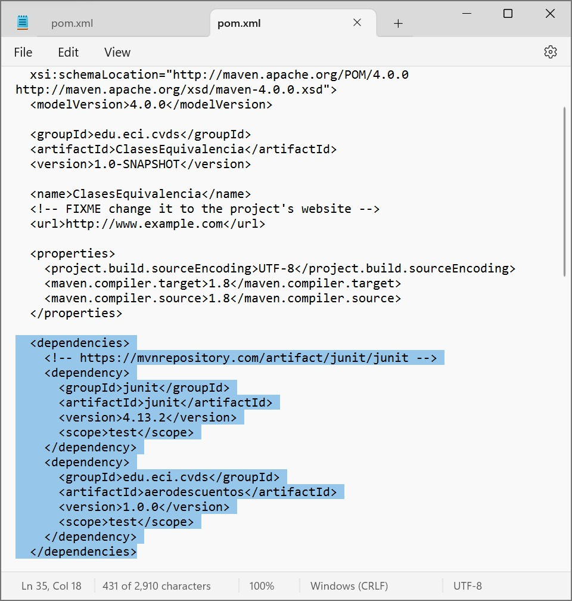

# LABORATORIO 3 - TDD

#### CLASES DE EQUIVALENCIA

### CREAR UN PROYECTO CON MAVEN
En el directorio de trabajo ejecutar el comando necesario para crear/generar un proyecto maven basado en un arquetipo:
```
Grupo (groupId): edu.eci.cvds
Artefacto (artifactId): ClasesEquivalencia
Paquete (package): edu.eci.cvds.tdd
archetypeArtifactId: maven-archetype-quickstart
```
Con el comando: 
```
mvn archetype:generate
```


### ACTUALIZAR Y CREAR DEPENDENCIAS EN EL PROYECTO

Busque en internet el repositorio central de maven.

Busque el artefacto JUnit y entre a la versión más nueva.


Ingrese a la pestaña de Maven y haga click en el texto de la dependencia para copiarlo al portapapeles.

Edite el archivo pom.xml y realice las siguientes actualizaciones:
- Agregue/Reemplace la dependencia copiada a la sección de dependencias.
- Hay que cambiar la versión delcompilador de Java a la versión 8, para ello, agregue la sección properties antes de la sección de dependencias:


### COMPILAR Y EJECUTAR
Ejecute los comandos necesarios de Maven, para compilar el proyecto y verificar que el proyecto se creó correctamente y los cambios realizados al archivo pom no generan inconvenientes.

Los pasos para ejecutar el proyecto y realizar la verificación son:

 1. Entrar a la carpeta 
 ```
   cd ClasesEquivalencias
``` 
 2. Ingresar el comando
```
   mvn package
```

Busque el comando requerido para ejecutar las pruebas unitarias de un proyecto desde Maven y ejecútelo sobre el proyecto. Se debe ejecutar la clase AppTest con resultado exitoso.

El comando requerido que nos permite ejecutar las pruebas unitarias es:
```
   mvn test
``` 


## EJERCICIO “REGISTRADURÍA”
Se va a crear un proyecto base para un cliente en la registraduría, en el cual se registrarán personas con intención de votar para las próximas
elecciones y se generarán los certificados electorales de aquellas personas cuyo voto sea válido.

Se usará la clase *persona* qué se describe más adelante. El servicio de la registradiría permitirá registrar personas que sean votantes.

### REQUERIMIENTOS
- Solo se registrarán votantes válidos
- Solo se permite una inscripción por número de documento

### HACER EL ESQUELETO DE LA APLICACION
Cree el archivo `RegisterResult.java` en el directorio `edu.eci.cvds.tdd.registry` con la enumeración:

*Revisar codigo fuente*

### EJECUTAR LAS PRUEBAS

Para correr las pruebas utilice:
```sh
$ mvn package
```
También puede utilizar:
```sh
$ mvn test
```


Revise cual es la diferencia. Tip: https://www.devopsschool.com/blog/maven-tutorials-maven-lifecycle-phases-goal

### FINALIZAR EL EJERCICIO
Piense en los casos de [equivalencia](https://prezi.com/-jp_rqhov1nn/particiones-o-clases-de-equivalencia/) que se pueden generar del ejercicio para la registraduría dadas las condiciones. Deben ser al menos 5.

1. Caso en el que hay edades invalidas (edades negativas).
2. Caso en el que hay una persona menor de edad.
3. Caso en el que una persona esta muerta.
4. Caso en el que hay una persona es votante (mayor de edad).
5. Caso en el que hay números de identidad duplicados


## EJERCICIO "DESCUENTO DE TARIFAS"

### REALIZAR DISEÑO DE PRUEBAS
Para realizar de forma correcta el diseño de sus pruebas responda las preguntas que se encuentran en el siguiente [documento](https://campusvirtual.escuelaing.edu.co/moodle/pluginfile.php/142929/mod_assign/intro/EjercicioClasesEquivalencia.pdf).


## Fronteras

Las condiciones que nos podrian llegar a generar errores en la operación:

1. Edad: Menor a 0 o mayor a 100.
2. Tarifa base: Menor o igual a 0.
3. Dias de antelación: Menores a 0.

### IMPLEMENTACIÓN DE LAS PRUEBAS
Descargue el archivo [`aerodescuentos.jar`](https://campusvirtual.escuelaing.edu.co/moodle/pluginfile.php/142929/mod_assign/intro/aerodescuentos-1.0.0.jar) y adicione esta nueva dependencia en el archivo `pom.xml` de su proyecto.
!
Para adicionar una librería personalizada al repositorio local de maven puede ejecutar el siguiente comando.
```  ```

```sh
$ mvn install:install-file -Dfile=aerodescuentos-1.0.0.jar -DgroupId=edu.eci.cvds -DartifactId=aerodescuentos -Dversion=1.0.0 -Dpackaging=jar
```
Cree el archivo `TarifasTest.java` en el directorio `src/test/java/edu/eci/cvds/tdd/aerodescuentos`.
Realice la implementación de las pruebas propuestas en la etapa de diseño de pruebas en esta clase. Para sus pruebas debe usar el método `calculoTarifa` de la clase `edu.eci.cvds.tdd.aerodescuentos.CalculadorDescuentos`, que se encuentran dentro del JAR de la librería personalizada.
Ejecute el comando de Maven para las fases de compilación y pruebas. Verifique el resultado exitoso de todas las pruebas y el reporte generado.


## Autores

Maria Valentina Torres\
Jose Ricardo Vasquez


