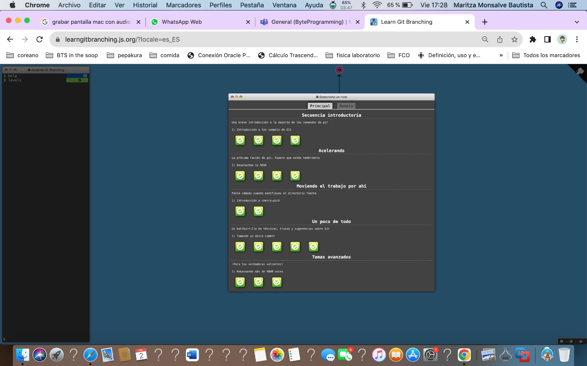
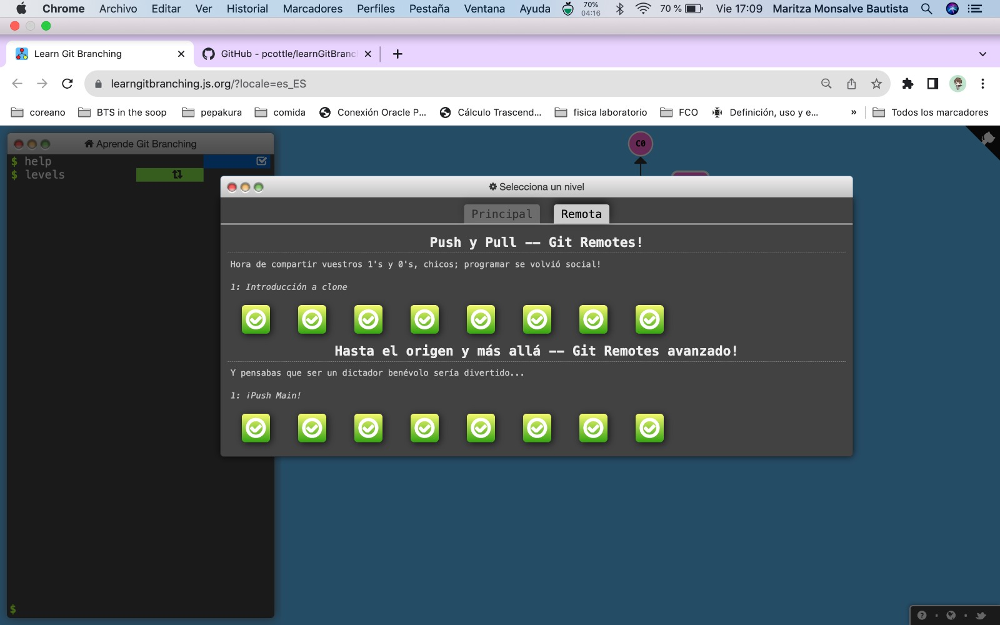

# __INFORMACIÓN DEL ESTUDIANTE__
## _Información básica_

* Nombre : Maria Valentina Torres Monsalve
* Id     : 1000097220
* Carrera: Ingenieria de sistemas
* Semestre: 5

## _Información personal_

### ¿Que te apasiona?

Desde que era pequeña, la repostería se ha convertido en mi gran pasión.\
 Me encanta pasar tiempo en la cocina junto a mi familia, mezclando\
  ingredientes, decorando cupcakes y horneando galletas. Para mí, cada\
   postre que preparo es como una pequeña obra de arte, llena de color y\
    sabor. Además, me encanta ver la sonrisa en los rostros de mis seres\
     queridos cuando prueban mis creaciones. La repostería me hace sentir\
      creativa y feliz, y siempre estoy emocionada por probar nuevas recetas\
       y aprender nuevas técnicas para sorprender a todos con mis deliciosos\
        dulces.

### Series favoritas

1. Aterrizaje de emegencia en tu corazón\
    
2. Vincenzo\
    

### Codigo

´´´
   
    import java.util.Scanner;

    public class CalcularAreaCirculo {
        public static void main(String[] args) {
            Scanner scanner = new Scanner(System.in);
            
            System.out.print("Ingresa el radio del círculo: ");
            double radio = scanner.nextDouble();
            
            double area = calcularAreaCirculo(radio);
            
            System.out.println("El área del círculo es: " + area);
            
            scanner.close();
        }
        
        public static double calcularAreaCirculo(double radio) {
            return Math.PI * Math.pow(radio, 2);
        }
    }

´´´

## __REPOSITORIO__

https://github.com/Mar972310/cvds-lab1-RMSS.git

## __CURSO GIT__

### Principal

### Remota

